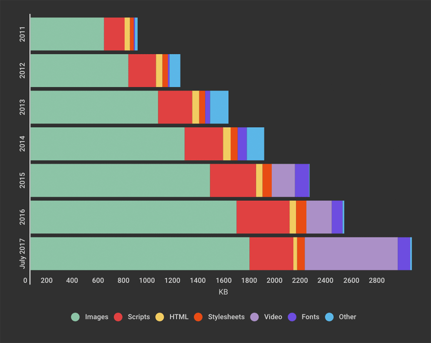
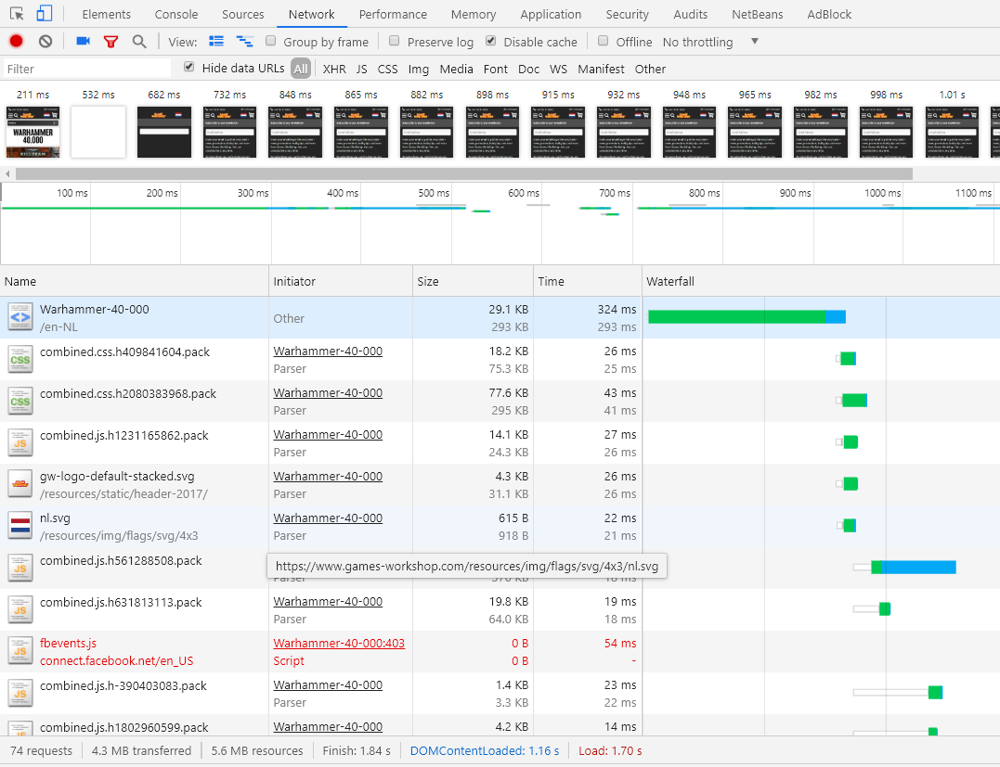
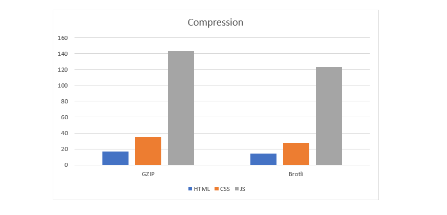
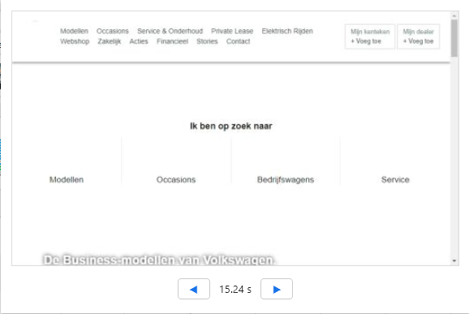
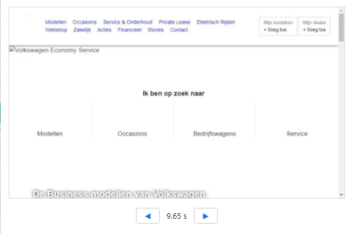

# How to make your website run faster

## Introduction
In the last 10 years website sizes have grown exponentially. Especially image sizes have grown a lot. In this article I will take a look at the measures that can be taken to ensure that your website is running smoothly, even on slow internet connections. This article is meant to give you some ideas about performance enhancement. I will not go into detail about all the optimizations mentioned but will provide sources where you can read up on those.



## Table of Contents
- [Where to begin](#where-to-begin)
- [Optimizations](#optimizations)
  - [Compression](#compression)
      - [No compression](#no-compression)
      - [GZIP](#gzip)
      - [Brotli](#brotli)
  - [Caching Policy](#caching-policy)
  - [Revisioning](#revisioning)
  - [Font Swapping](#font-swapping)
  - [Images to WebP](#images-to-webp)
- [Conclusion](#conclusion)

## Where to begin
First you need to understand what might make your website slow and where to find this. If you go to your developer tools in chrome
and click on the network tab. If you press `ctrl-r` you will see a lot of information. I will go through a couple of tabs.



## Optimizations

I made a top 4 of different optimizations that are either huge gains or really easy to implement (or both).

1. **Compression** - Most new websites use compression in the form of GZIP. But there is a better optimised way to do it with Brotli. Really easy to implement. 
2. **Caching policy** -  Cache the resources so the repeat view loads faster.
3. **Font swapping** - Showing fallback fonts until custom font is loaded. Really easy to implement.
4. **Jpeg -> Webp** - Web friendly format for images. Makes them much, much smaller. Might take some time to implement.

### Compression

Compression is important in reducing the bite size for your website. Most new websites use compression in the form of GZIP. But with Brotli the bite size gets even more reduced. I placed this in my number one spot because, even though the reduction may not seem so big, it is really easy to implement. Implementing Brotli should not take longer than an hour. Follow [this link](https://medium.com/oyotech/how-brotli-compression-gave-us-37-latency-improvement-14d41e50fee4) to read a more in depth article about what brotli is and does.

The file sizes below were from a car manufacturers website. You can see that the compression reduces de file sizes quiet a lot.

#### No compression
- HTML 106kb 
- CSS 279kb 
- JS 470kb 

#### GZIP
- HTML 17.1kb | 83.88% Compressed
- CSS 34.9kb | 87.5% Compressed
- JS 143kb | 69.58% Compressed

#### Brotli
- HTML 14.2kb | 86.61% Compressed
- CSS 27.6kb | 90.11% Compressed
- JS 123kb | 73.83% Compressed



### Caching Policy

Remember those file sizes above? The HTML, CSS and JS files? Wouldn't it be nice if those file sizes would be 0kb? There is a solution. 
**Caching**

For caching to be implemented you need a couple of lines of code:

```js
app.use((req, res, next) => {
  res.setHeader('Cache-Control', 'max-age=' + 365 * 24 * 60 * 60); next();
});
```

What this does is that it saves the files of the visited pages in the browser cache for a set amount of time. This means that on return visits the files load instantly. One problem this creates is that changes made in the files will not take effect. Enter **revisioning**.

### Revisioning

With file revisioning you add unique hash digits to your file names (on build).

Example: `styles.min.css` will be called `styles-6gf647qz.min.css` instead. When you make changes to your CSS file you should give your file new unique hash digits.

This means your CSS will always be cached (and not do a request to check if it is changed). It will only do a request if the new CSS file name is not equal to the cached file name.

```js
const gulp = require("gulp");
const rev = require("gulp-rev");

const inputDir = "public/";
const manifestFilename = "rev-manifest.json";

gulp.src([inputDir + "**/*.{css,js}"])
  .pipe(rev())
  .pipe(gulp.dest(inputDir))
  .pipe(rev.manifest(manifestFilename))
  .pipe(gulp.dest(inputDir));
```

What this piece of code does is create a manifest.json. In this file is an object that holds the paths to the revisioned css/js files. It also creates those revisioned files. Then in your views create a variable path to those files. This variable is looked up from the manifest file and passed along by the server. If you now make changes to your files and run the build your new variables will be created and the new files loaded into te website.

### Font Swapping

With font swapping you make sure that it doesn't take to long before the text in your website becomes visible. On slow 3G internet connections users may be forced to wait for more than 15 seconds before the custom fonts are loaded. If you don’t use font swapping it will take this long before any text is visible. With font swapping you can reduce this waiting time and show the fallback fonts until the custom fonts are loaded. Making the perceived performance much better. To implement this you only need to add `font-display: swap;` to all `@font-face` rules like so:

```css
@font-face {
    font-family: VWHeadWeb;
    src: url(../../../Fonts/VW-PKW/VWHeadWeb-Light.woff2) format("woff2"), 
         url(../../../Fonts/VW-PKW/VWHeadWeb-Light.woff) format("woff");
    font-weight: 300;
    font-style: normal;
    font-display: swap;
}
```



### Images to WebP
Implementing **WebP images** greatly reduces file sizes, on avarege 25%. And although it might take some time to convert all the content it really is worth it. But how does it work?

To implement **WebP images** you use the `<picture>` tag and set a webp file as the source. For browsers that don't support WebP use the `` tag as fallback like in the piece of code below.

```html
<picture>
    <source type="image/webp" srcset="image.webp">
    <source type="image/jpeg" srcset="image.jpg">
    
</picture>
```

## Conclusion

So here are some of the solutions to having a slow and cumbersome website. These are but a couple of solutions, there are many more. But in my opinion these are relatively easy to implement and have good results. I hope you learned something new and are inspired to find more performance enhancing methods on your own.
