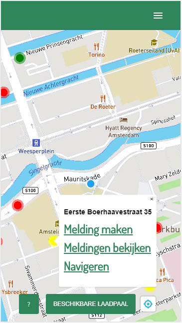
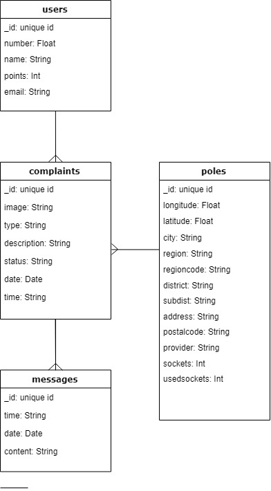
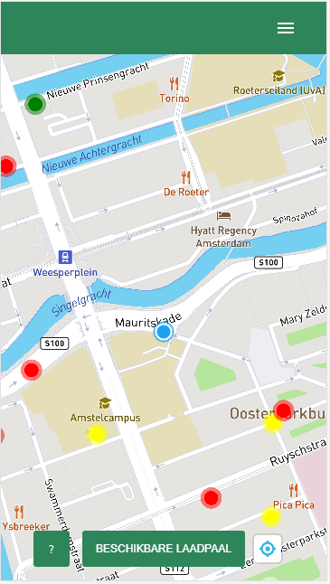
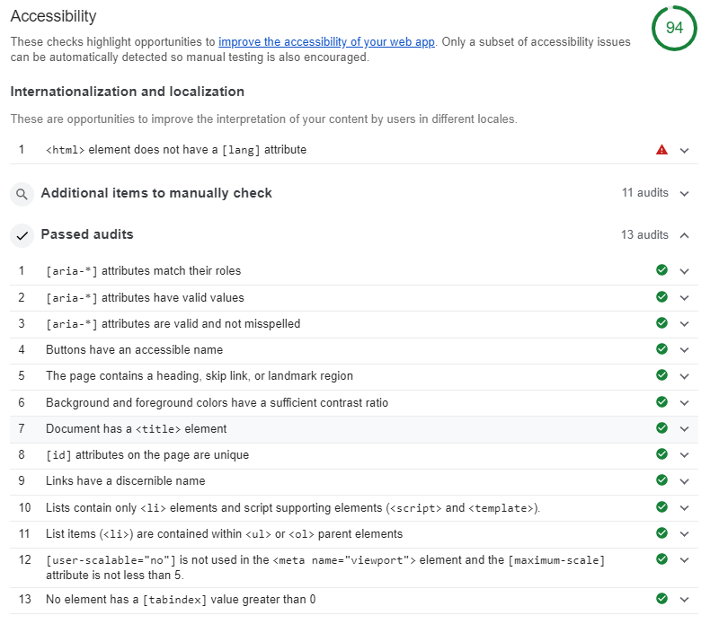

# Product Biografie



## Belangrijke Links
1. [Repo van de applicatie](https://github.com/roobinh/meesterproef-laadpaal) (Meldpaal)
2. [Design Rationale](https://laadpaal.gitbook.io/de-meldpaal-design-rationale/) (voor alle informatie over de applicatie)
3. [De Applicatie](https://laadpalen.herokuapp.com/) (Live DEMO)

## Inhoud
- [Inleiding](#inleiding)
- [Leerdoelen](#leerdoelen)
- [Week I](#week-i)
  - [Concepting](#concepting)
  - [Developer Stack](#developer-stack)
  - [Eerste Prototype](#eerste-prototype)
- [Week II](#week-ii)
  - [Datamodel](#datamodel)
  - [Tweede Prototype](#tweede-prototype)
- [Week III](#week-iii)
  - [Datamodel](#datamodel)
  - [Mapbox](#mapbox)
- [Week IV](#week-iv)
  - [Clusters](#clusters)
  - [Chat](#chat)
  - [UX](#ux)
- [Week V](#week-v)
- [Reflectie](#reflectie)  
  - [Web App From Scratch](#web-app-from-scratch)  
  - [Web design](#web-app-from-scratch)  
  - [Performance Matters](#web-app-from-scratch)  
  - [Real-Time Web](#real-time-web)  
  - [MapBox](#mapbox)  
  - [UX](#ux)  
- [Mijn rubric](#mijn-rubric)

## Inleiding

In dit document, de productbiografie, ga ik per week door het project heen. Ik zal elke week een korte beschrijving geven van wat we hebben gedaan. Met daarbij de verschillende schetsen, itteraties en uitwerkingen. Aan deze onderdelen zijn features verbonden die ik naast een aantal leerdoelen zal leggen. Per feature/leerdoel zal ik kijken welke rubric erbij past en dit onderbouwen.


## Leerdoelen


| Vakken                   | Doel                                               | Beschrijving                                                                                                                             |
| ------------------------ | --------------------------------------------------- | --------------------------------------------------------------------------------------------------------------------------------------- |
| **Web App From Scratch** | _Data Structuur._                   | In dit project wilde ik veel aandacht besteden aan het vooraf structureren van de data.          |
|                          | _GraphQL Implementeren._            | Omdat GraphQL een erg krachtige manier is om met je database om te gaan wilde ik dit graag implementeren |
| **Real-Time Web**    | _Sockets in een chat functionaliteit implementeren._ | Ook al heb ik eerder met sockets gewerk bij real-time web heb ik dit toch als leerdoel. Ik heb nog niet eerder een chat functionaliteit geimplementeerd. Zeker niet eentje die naast real-time ook de berichten opslaat in de database.          |


Een niet klein onderdeel van deze meesterproef voor mij, maar niet in de andere vakken specifiek behandeld

| Technology | Goal                 | Description                                                                                  |
| ---------- | -------------------- | -------------------------------------------------------------------------------------------- |
| **UX** | _Beter worden in UX._ | Dit is een van mijn zwakste kanten als frontender. Hier wil/moet ik beter in worden. Vooral de micro interacties die plaatsvinden wanneer er user input is wil ik beter in worden  |

[Hier](#reflection-) mijn reflectie op de leerdoelen.


## Week I
**27-31 juli**

In de eerste week hebben we een briefing gehad van onze opdrachtgever J. R. Helmus. Hierin werd ons uitgelegd wat voor applicatie er nodig was en welke stakeholders er bij dit project betrokken waren. Aan het einde van de briefing ben ik met Robin Hofman samen gaan werken.

### Concepting
Voordat we konden beginnen met schetsen moesten we duidelijk hebben welke soorten meldingen er gedaan zouden kunnen worden. Hier hebben we een lijst van gemaakt:

- De laadpaal...
  - ...is uit/defect
  - ...is te lang bezet
  - ...is niet te bereiken
  - ...kabel is kapot
  - ...is bezet door een niet elektrische auto
- De parkeerplek...
  - ...is te lang bezet
  - ...is niet te bereiken
  - ...is bezet door een niet elektrische auto
- Mijn pasje...
  - ...werkt niet
  - ...is kapot
  - ...heb ik niet bij me

Robin en ik waren het al vrij snel eens over hoe de applicatie zou moeten gaan werken. Hier hebben we een aantal simpele wireframes over gemaakt. Te zien hieronder.


### Developer Stack
Nadat we een paar schetsen hebben gemaakt zijn we bezig gegaan met het bedenken welke developerstack we in gebruik zouden nemen.  
Server: [NodeJS](https://nodejs.org/en/)  
Rendering: [EJS](https://ejs.co/)  
Database: [GraphQL](https://graphql.org/)/[MongoDB](https://www.mongodb.com/)

### Eerste Prototype
Het eerste prototype dat we gemaakt hebben is in [Adobe XD](https://www.adobe.com/products/xd.html) gemaakt. Hiervan hebben we een klik baar prototype gepresenteerd aan de opdrachtgever in week twee. Hieronder een aantal schermen en wat ze doen.

Op de 'map' pagina kan de gebruiker een paal selecteren om een melding over te doen. Dit hebben we later geïmplementeerd met mapbox.


Wanner de gebruiker een paal heeft geselecteerd krijgt hij/zij een smooth werkend keuzemenu te zien waarbij gekozen kan worden uit de verschillende dingen die mis kunnen zijn.


Wanneer een melding is gelukt krijgt de gebruiker een nieuwe, wel beschikbare, laadpaal te zien waar hij/zij naartoe geleid kan worden.


## Week II
**3-8 juni**

In week twee hebben we in het eerste feedbackgesprek ons prototype laten zien aan de opdrachtgever. Hij was over het algemeen erg tevreden. De kleurkeuze was hij het alleen helemaal niet mee eens. We hebben voor een andere, meer groene, kleur gekozen. Ik ben daarna verder gegaan met het bouwen van de verschillende pagina's. Tot nu toe enkel statisch. Robin was tegelijk bezig met het opzetten van de database en de server. Zodat we het aan het einde van de week front end en back end aan elkaar konden knopen.

### Datamodel
Om de database op te zetten hadden we een datamodel nodig. Het is belangrijk om hier goed over na te denken voordat je de rest van de applicatie gaat maken. Anders krijg je later veel dubbel werk. Ons datamodel, tot nu toe, zag er zo uit:

<details>
<summary>Data model</summary>

```USERS
  ID: unique ID
  email
  name
  number
  points (?)

POLES
  ID: laadpaal ID
  longitude
  latitude

COMPLAINTS
  ID: complaint ID
  user: user ID
  pole: pole id
  type
  description
  image
  status
  date
```
</details>


### Tweede Prototype
Het tweede prototype dat we gemaakt hebben was nog zonder een werkende kaart zoals we wel wilde. Maar was vooral om even te kijken bij de opdrachtgever hoe hij het invullen van een melding vond gaan. Dit hebben we in week 3 getest. Hieronder een paar van de belangrijkste schermen die we hebben getest.

Een redesign van de vorige week en nu, omdat het gecodeerd is, met animaties.


Een redesign van de vorige week en nu, omdat het gecodeerd is, met animaties.


## Week III
**10-14 juni**

Het tweede feedbackgesprek met de opdrachtgever vond in week 3 plaats. Hierbij hebben we laten zien hoe de applicatie in zijn werking zal gaan. Ook hebben we een aantal vragen gesteld over welke data hij graag terug zou zien in de database. Over het algemeen was hij zeer tevreden, hij vond het geweldig dat er al een soort prototype werkend was. En dit zonder dat er een werkende kaart in applicatie zat, en zonder dat er echte data van palen beschikbaar was. Na het gesprek zijn we vooral bezig geweest met het implementeren van [MapBox](https://www.mapbox.com/?utm_medium=sem&utm_source=google&utm_campaign=sem|google|brand|chko-googlesearch-pr01-mapboxbrand-br.exact-intl-landingpage-search&utm_term=brand&utm_content=chko-googlesearch-pr01-mapboxbrand-br.exact-intl-landingpage-search&gclid=CjwKCAjwr8zoBRA0EiwANmvpYOA-At5_R2NJ1xRzM_QY9aGmr1TshuPxWZqSEfE_n3As4ckJtOFIUBoCvNgQAvD_BwE) en het beschikbaar maken van de data van de laadpalen. Die data heeft J. R. Helmus ons aan het begin van de week aangeleverd.

### Datamodel

Omdat er een hele hoop nieuwe data in de database moest hebben we ook nog even goed gekeken naar het datamodel. We hebben goed nagedacht over wat we allemaal willen kunnen laten zien in de applicatie over een paal/melding/chat. Zo hebben we bij veel onderdelen een timestamp toegevoegd. Ook was het va belang om te kunnen zien hoeveel stopcontacten er vrij zouden zijn bij een laadpaal.



### Mapbox

Deze week hebben we ons ook gefocussed op MapBox en omdat we nu ook de data van ongeveer 1500 palen hadden konden we die ook plotten op de kaart. We hadden hier nog wel wat problemen mee aangezien de kaart nogal stotterend werkte omdat er teveel points(1500!) gerenderd waren. Ook gebruikten we voor de points een image, waardoor er veel werd gevraagd van de browser.



## Week IV
**17-21 juni**

Deze week was onze opdrachtgever op vakantie en konden we dus geen feedbackgesprek inplannen. Dat heeft ons er natuurlijk niet van weerhouden om lekker door te werken.

### Clusters

Het eerste probleem dat we moesten tackelen was ervoor zorgen dat de kaart beter zou gaan performen. Dit hebben we gedaan door [clusters](https://docs.mapbox.com/android/maps/overview/clustering/) toe te voegen aan mapbox. Wat dit betekent is dat de pointers op een hoger zoom level geclusterd getoond worden. Hierdoor is de performance beter. De pointers zijn in zekere zin nog steeds gecreëerd. 
Hieronder de code 'before' en 'after'. 

<details>
<summary>Before</summary>

``` js       
        var pointer = {
          type: "FeatureCollection",
          features: [
            {
              type: "Feature",
              geometry: {
                type: "Point",
                coordinates: [pole.longitude, pole.latitude]
              },
              properties: {
                title: pole.address
              }
            }
          ]
        };
```

</details>
<details>
<summary>After</summary>

``` js       
        let pointer = {
            type: "Feature",
            geometry: {
              type: "Point",
              coordinates: [pole.longitude, pole.latitude]
            },
            properties: {
              address: pole.address,
              id: pole._id,
              lngLat: pole.longitude + " " + pole.latitude,
              color: color,
              showComplaints: showComplaints
            }
          };
          pointers.push(pointer);
        }
      });

      map.addSource("earthquakes", {
        type: "geojson",
        data: {
          type: "FeatureCollection",
          crs: {
            type: "name",
            properties: { name: "urn:ogc:def:crs:OGC:1.3:CRS84" }
          },
          features: pointers
        },
        cluster: true,
        clusterMaxZoom: 14,
        clusterRadius: 50
      });

      map.addLayer({
        id: "clusters",
        type: "circle",
        source: "earthquakes",
        filter: ["has", "point_count"],
        paint: {
          "circle-color": [
            "step",
            ["get", "point_count"],
            "#51bbd6",
            100,
            "#f1f075",
            750,
            "#f28cb1"
          ],
          "circle-radius": [
            "step",
            ["get", "point_count"],
            20,
            100,
            30,
            750,
            40
          ]
        }
      });
```
</details>

### Chat

Een van de wensen van de opdrachtgever was ook het contact tussen de gebruiker en een 'dashboard'. Dit hebben wij toegevoegd aan de hand van [sockets](https://socket.io/). Dit was best nog wel ven doorbijten want om de een of andere reden ging het vrij lastig. We hebben hier zeker twee dagen aan gezeten. Het werk redelijk. Alle berichten worden goed opgeslagen in de database maar sockets weigert soms te werken. Hierdoor kan het realtime gedeelte van de chat soms uitvallen helaas.

### UX
We hebben ook veel tijd besteed aan het verbeteren van de UX. Dit is iets waar zowel Robin als ik van nature niet heel goed in zijn. Maar toch denk ik dat het aardig is gelukt. Denk aan de affordance van knoppen, hoe die zich gedragen. Hieronder een lijst met dingen die we deze week aan de UX hebben verbeterd: 
- Alternatieve laadpaal pagina aanpassen
- Als er geen afbeelding is, niks laten zien
- Locatie bij melding (adres)
- Legenda bij map
- Uitleg wat je kan doen op de map
- Laadpalen groter
- Meldingen bekijken als er geen meldingen zijn uitschakelen
- Cursor pointer
- terug knop
- Selecteer waar het probleem ligt boven 'de laadpaal..'
- Disable zoom
- en nog veel meer....


## Week V
**24-27 juni-**

In de laatste week hebben we vooral de puntjes op de i gezet en veel gedocumenteerd. De laatste aanpassingen in de app die we hebben gedaan zijn: 
- Chat form maken zodat enter werkt
- Name fixen in chat
- CSS voor de chat, beetje pimpen
- Onboarding
- Admin moet kunenn typen *niet gelukt* 
- Sockets werken op heroku *niet gelukt*

## Reflectie

### Web App From Scratch
Web app From scratch ging over het creeren van structuur, fetching data en sorteren/filteren van data. In dit project zijn we heel gestructureerd bezig gegaan met het opzetten van de database in GraphQL/MongoDB. Hierdoor was het ophalen van de data en het sorteren/filteren ervan gedurende het hele project erg gemakkelijk om mee te werken. Door dit van te voren goed uit te zoeken hebben we een hele hoop extra werk en hoofdpijn weten te voorkomen. Ik denk dat ik bij het volgende project waaraan ik zal werken ik met dezelfde structuur qua database zal gaan werken.

### Web design
Voor webdesign heb ik een accessibility test gedaan op de verschillende pagina's die kwam erg goed naar boven. De semantiek was overal uitstekend evenals de tab order van de applicatie. Ook de buttons geven afdoende feedback op gebruikersinput.



### Performance Matters
Voor performance matters hebben wij GraphQL gebruikt. GraphQL is in het gebruik veel gemakkelijker omdat je geneste data terug kan vragen. Dit zorgt ervoor dat je op de server of in de client niet nog hoeft te mappen op de binnengekomen data. 

### Real-Time Web
Het implementeren van sockets was best nog wel een klus en ging moeilijker dan verwacht uiteindelijk werkt het lokaal. Ook al is er soms een kleine bug. Helaas hebben we het op heroku niet werkend kunnen krijgen. Wat ik graag nog had willen toevoegen is een event die naar de dashboard geemit wordt wanneer een nieuwe melding wordt aangemaakt### MapBox

### MapBox

Vóór dit project had ik nog nooit met MapBox gewerkt dus dit leek mij een hele goede uitdaging. Robin had hier wel al mee gewerkt, dit zorgde ervoor dat ik een hoop van de valkuilen al uitgelegd kon krijgen. Erg handig.

Wat je vooral leuk is aan MapBox, is dat je erg leuke 'fly to' functies heb die de kaart smooth en gebruiksvriendelijk kunnen maken.

<details>
<summary>Fly To</summary>

``` js       
function flyToNearestPole() {
  if (dichstbijzijnde[1] == 0 && dichstbijzijnde[2] == 0) {
      console.log("paal nog niet berekend.");
    } else {
      map.flyTo({
        center: [dichstbijzijnde[2], dichstbijzijnde[1]],
        zoom: 16
      });
    }
  }
```
</details>

Ook het toevoegen van cluster, dat overigens nog best lastig was, was een leerzaam onderdeel.

### UX

UI/UX is nooit mijn sterkste kant geweest. Omdat ik tijdens dit project met Robin, die van een ICT opleiding komt, samenwerkte viel het grootste gedeelte van de UI/UX onder mijn verantwoordelijkheid. Dit betekende dat ik me best veel heb bezig gehouden met het verbeteren van de UX in de applicatie. Ik denk dat het nog steeds niet de allermooiste applicatie van de meesterproef is. Maar ik vind wel dat ik best veel stappen heb gemaakt, zeker wat betreft UX.


## Mijn Rubric
[Mijn rubric](https://docs.google.com/spreadsheets/d/1GgvnGCYsqH6agW-4KcxYMsjE5_POe2UOi12ONM4nYsM/edit?usp=sharing)

