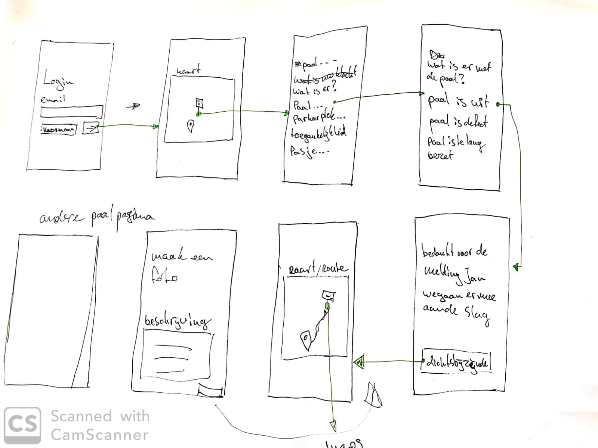
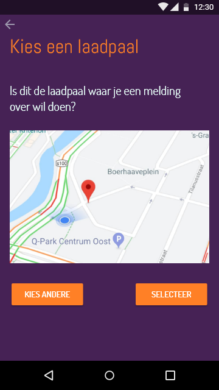
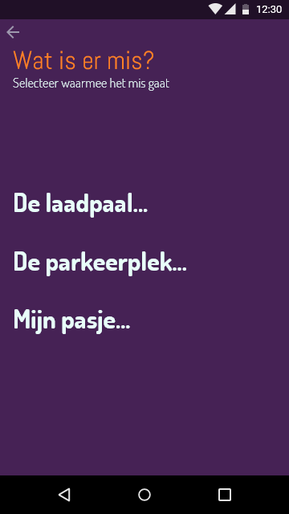
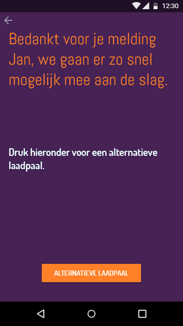
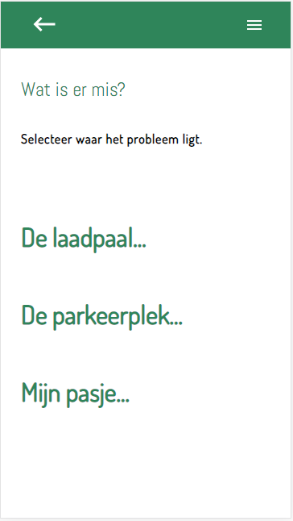
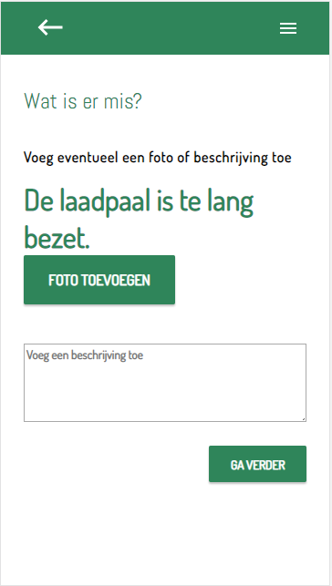

# Product Biografie


## Inhoud
- [Inleding](#inleiding)
- [Week I](#week-i)
  - [Concepting](#concepting)
  - [Developer Stack](#developer-stack)
  - [Eerste Prototype](#eerste-prototype)
- [Week II](#week-ii)
  - [Datamodel](#datamodel)
  - [Tweede Prototype](#tweede-prototype)
- [Week III](#week-iii)
  - [Datamodel](#datamodel)
- [Week IV](#week-iv)
- [Week V](#week-v)
- [Leerdoelen](#leerdoelen)
- [Mijn rubric](#mijn-rubric)

## Inleiding

In dit document, de productbiografie, ga ik per week door het project heen. Ik zal elke week een korte beschrijving geven van wat we hebben gedaan. Met daarbij de verschillende schetsen, itteraties en uitwerkingen. Aan deze onderdelen zijn features verbonden die ik naast een aantal leerdoelen zal leggen. Per feature/leerdoel zal ik kijken welke rubric erbij past en dit onderbouwen.

## Week I
**27-31 juli**

In de eerste week hebben we een briefing gehad van onze opdrachtgever J. R. Helmus. Hierin werd ons uitgelegd wat voor applicatie er nodig was en welke stakeholders er bij dit project betrokken waren. Aan het einde van de briefing ben ik met Robin Hofman samen gaan werken.

### Concepting
Voordat we konden beginnen met schetsen moesten we duidelijk hebben welke soorten meldingen er gedaan zouden kunnen worden. Hier hebben we een lijst van gemaakt:

- De laadpaal...
  - ...is uit/defect
  - ...is te lang bezet
  - ...is niet te bereiken
  - ...kabel is kapot
  - ...is bezet door een niet elektrische auto
- De parkeerplek...
  - ...is te lang bezet
  - ...is niet te bereiken
  - ...is bezet door een niet elektrische auto
- Mijn pasje...
  - ...werkt niet
  - ...is kapot
  - ...heb ik niet bij me

Robin en ik waren het al vrij snel eens over hoe de applicatie zou moeten gaan werken. Hier hebben we een aantal simpele wireframes over gemaakt. Te zien hieronder.



### Developer Stack
Nadat we een paar schetsen hebben gemaakt zijn we bezig gegaan met het bedenken welke developerstack we in gebruik zouden nemen.  
Server: [NodeJS](https://nodejs.org/en/)  
Rendering: [EJS](https://ejs.co/)  
Database: [GraphQL](https://graphql.org/)/[MongoDB](https://www.mongodb.com/)

### Eerste Prototype
Het eerste prototype dat we gemaakt hebben is in [Adobe XD](https://www.adobe.com/products/xd.html) gemaakt. Hiervan hebben we een klikbaar prototype gepresenteerd aan de opdrachtgever in week twee. Hieronder een aantal schermen en wat ze doen.

Op de 'map' pagina kan de gebruiker een paal selecteren om een melding over te doen. Dit hebben we later geimplementeerd met mapbox.



Wanner de gebruiker een paal heeft geselecteerd krijgt hij/zij een smooth werkend keuzemenu te zien waarbij gekozen kan worden uit de verschillende dingen die mis kunnen zijn.



Wanneer een melding is gelukt krijgt de gebruiker een nieuwe, wel beschikbare, laadpaal te zien waar hij/zij naartoe geleid kan worden.




## Week II
**3-8 juni**

In week twee hebben we in het eerste feedbackgesprek ons prototype laten zien aan de opdrachtgever. Hij was over het algemeen erg tevereden. De kleurkeuze was hij het alleen helemaal niet mee eens. We hebben voor een andere, meer groene, kleur gekozen. Ik ben daarna verder gegaan met het bouwen van de verschillende pagina's. Tot nu toe enkel statisch. Robin was tegelijk bezig met het opzetten van de database en de server. Zodat we het aan het einde van de week front end en back end aan elkaar konden knopen.

### Datamodel
Om de database op te zetten hadden we een datamodel nodig. Het is belangrijk om hier goed over na te denken voordat je de rest van de applicatie gaat maken. Anders krijg je later veel dubbel werk. Ons datamodel, tot nu toe, zag er zo uit:

```USERS
  ID: unique ID
  email
  name
  number
  points (?)

POLES
  ID: laadpaal ID
  longitude
  latitude

COMPLAINTS
  ID: complaint ID
  user: user ID
  pole: pole id
  type
  description
  image
  status
  date
```

### Tweede Prototype
Het tweede prototype dat we gemaakt hebben was nog zonder een werkende kaart zoals we wel wilde. Maar was vooral om even te kijken bij de opdrachtgever hoe hij het invullen van een melding vond gaan. Dit hebben we in week 3 getest. Hieronder een paar van de belangrijkste schermen die we hebben getset.

Een redesign van de vorige week en nu, omdat het gecodeerd is, met animaties.


Een redesign van de vorige week en nu, omdat het gecodeerd is, met animaties.


## Week III
**10-14 juni**

Het tweede feedbackgesprek met de opdrachtgever vond in week 3 plaats. Hierbij hebben we laten zien hoe de applicatie in zijn werking zal gaan. Ook hebben we een aantal vragen gesteld over welke data hij graag terug zou zien in de database. Over het algemeen was hij zeer tevreden, hij vond het geweldig dat er al een soort prototype werkend was. En dit zonder dat er een werkende kaart in applicatie zat, en zonder dat er echte data van palen beschikbaar was.Na het gesprek zijn we vooral bezig geweest met het implementeren van [MapBox](https://www.mapbox.com/?utm_medium=sem&utm_source=google&utm_campaign=sem|google|brand|chko-googlesearch-pr01-mapboxbrand-br.exact-intl-landingpage-search&utm_term=brand&utm_content=chko-googlesearch-pr01-mapboxbrand-br.exact-intl-landingpage-search&gclid=CjwKCAjwr8zoBRA0EiwANmvpYOA-At5_R2NJ1xRzM_QY9aGmr1TshuPxWZqSEfE_n3As4ckJtOFIUBoCvNgQAvD_BwE) en het beschikbaar maken van de data van de laadpalen. Die data heeft J. R. Helmus ons aan het begin van de week aangeleverd.

### Datamodel

Omdat er een hele hoop nieuwe data in de database moest hebben we ook nog even goed gekeken naar het datamodel. 


### Mapbox

Voor 12/06/2019:
- MapBox implementeren
- Palen op MapBox weergeven
- On click -> navigeren of klacht
- Footer/fixed buttons onderaan pagina
- Successpagina fixen
- PowerPoint maken

## Week IV
**17-21 juni**
## Week V
**24-06**
## Leerdoelen
## Mijn Rubric


- opdracht
- onze oplossing
- features
- leerdoelen per feature
- rubric per feature
- uitleg per rubric
# Meesterproef 2019 @cmda-minor-web · 2018-2019

In de Meesterproef ga je toepassen wat je in de Minor Webdev hebt geleerd. 
Voor de Meesterproef krijg je een opdracht van een echte opdrachtgever. 
Je gaat leren hoe je je geleerde kennis en skils kan gebruiken om een oplossing voor een probleem te ontwerpen. Testen, maken, evalueren
, testen, maken ...
Je kan kiezen uit verschillende projecten. Hier ga je 5 weken aan werken

Coaches: Joost Faber, Laurens Aarnoudse, Vasilis van Gemert, Janno Kapritsias en Koop Reynders.

## Werkwijze

Voor de Meesterproef geef je met een eerste en tweede keuze aan welk project je graag wil doen. Daarna wordt door de coaches een indeling gemaakt.  

In de eerste week krijg je een briefing bij de opdrachtgever en schrijf je een debriefing. 
Dat is de opdracht en de doelstellingen in eigen woorden beschreven. 
Daarna ga je iedere week een proof-of-concept bespreken met je opdrachtgever. 
In week 5 presenteer je het eindresultaat tijdens een expositie. 
Hiervoor moet je ook een passende presentatie maken.

Elke week zijn er 2 coachingsmomenten gepland. 
Op vrijdag ga je naar de opdrachtgever om je vorderingen te bespreken.

- Maandag/Dinsdag - Debriefing met een van de coaches.
- Woensdag/Donderdag - Code review met een van de coaches.
- Vrijdag - Bespreking met de opdrachtgever.


## Criteria en beoordeling

[WAFS Rubric](https://docs.google.com/spreadsheets/d/e/2PACX-1vTjZGWGPC_RMvTMry8YW5XOM79GEIdgS7I5JlOe6OeeOUdmv7ok1s9jQhzojNE4AsyzgL-jJCbRj1LN/pubhtml?gid=0&single=true)

[Performance Matters Rubric](https://docs.google.com/spreadsheets/d/e/2PACX-1vTO-pc2UMvpT0pUjt6NJeckc5N9E7QvCxEfVJW1JjuM0m_9MM8ra05J0s6br486Rocz5JVMhAX_C37_/pubhtml?gid=0&single=true)

[REal Time Web Rubric](https://docs.google.com/spreadsheets/d/e/2PACX-1vSd1I4ma8R5mtVMyrbp6PA2qEInWiOialK9Fr2orD3afUBqOyvTg_JaQZ6-P4YGURI-eA7PoHT8TRge/pubhtml)

[Mijn rubric](https://docs.google.com/spreadsheets/d/1GgvnGCYsqH6agW-4KcxYMsjE5_POe2UOi12ONM4nYsM/edit?usp=sharing)


### Design rationale
In de Design rationale schrijf je de debriefing, de probleem-definitie, toon je de oplossing en schrijf je een uitleg van de code. 
De Design rationale is een verantwoording van je ontwerp.

### Product biografie
In het eindproject doorloop je een iteratief proces. 
Elke week bespreek je met je opdrachtgever je vorderingen en ideeen. 
In de Product biografie hou je stap voor stap bij wat je allemaal hebt gedaan. 
Je schrijft over het proces, de werkwijze en de planning. 
Ook schetsen, testen, uitprobeersels en inspiratie zijn deel van de Product biografie.

### Reflectie op eigen niveau
Aan de hand van de vakrubrics reflecteer je systematisch op je werk. 
In een aantal gesprekken met een coach _reviewen_ we de code van je project. 
Dit doen we op basis van de rubrics van de verschillende vakken. 
Zo krijg je een goed beeld van je eigen niveau, mogelijke aandachtspunten en/of aspecten van het design-proces waar je je nog op kan verbeteren.

### Een blije klant
Voor de klant maak je een (werkend) prototype. Gericht op een bepaalde gebruikersgroep, geschikt voor verschillende apparaten, met echte data, én een goede UX. 
Jeweettoch. 
Een blije klant is een goede klant. 
Soms ontkom je er niet aan dat je een beetje eigenwijs moet doen. 
Dan doe je juist niet wat de klant wil en probeer je de opdrachtgever te overtuigen met een proof-of-concept. 
En soms kan het voorkomen dat het proces niet helemaal soepel loopt. 
Dat hoort erbij en daar leer je van.
Aan het eind van het project vragen we de klant feedback op het geleverde werk... 
