# Weekly-Nerd

## Inhoud

- [6 Februari	Sketchnotes met Maaike van Cruchten en Brit Wijnmaalen](#6-februari)
- [13 Februari	Stephan Hay over Design Patterns](#13-februari)
- [27 Februari	Cyd Stumpel (ex) & Dennis Spierenburg (ex) over werken als Frontender bij Matise](#27-februari)
- [13 Maart	Maike Klip over ontwerpen voor vluchtelingen](#13-maart)
- [20 Maart	Ischa Gast over A11y](#20-maart)
- [27 Maart	Workshop PE](#27-maart)
- [10 April	Daan Rongen over afstuderen en je eigen signatuur behouden](#10-april)

## 6 Februari
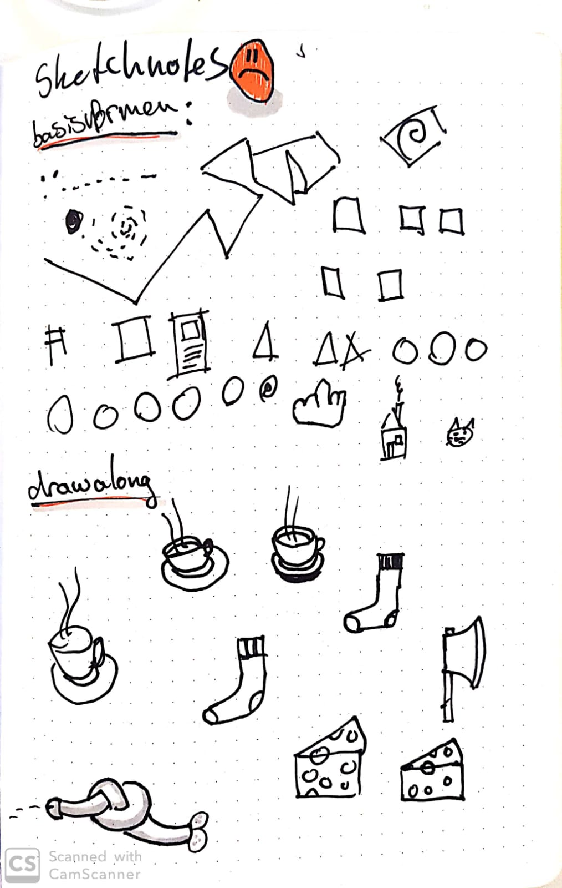
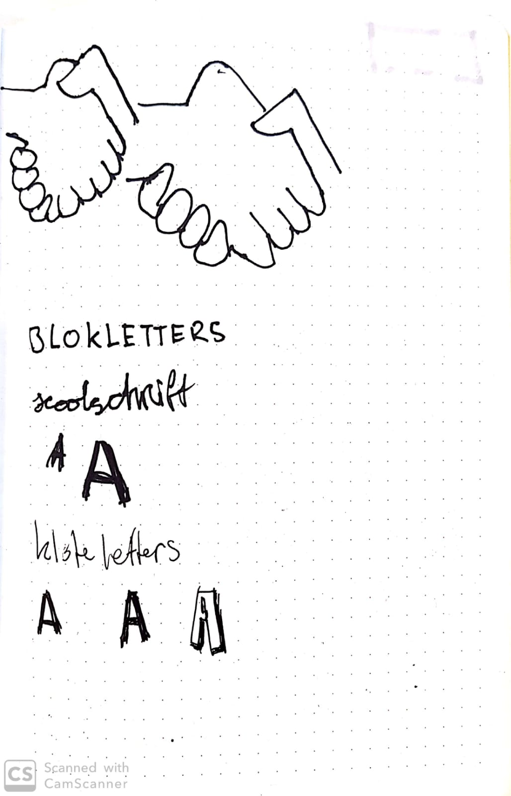
## 13 Februari
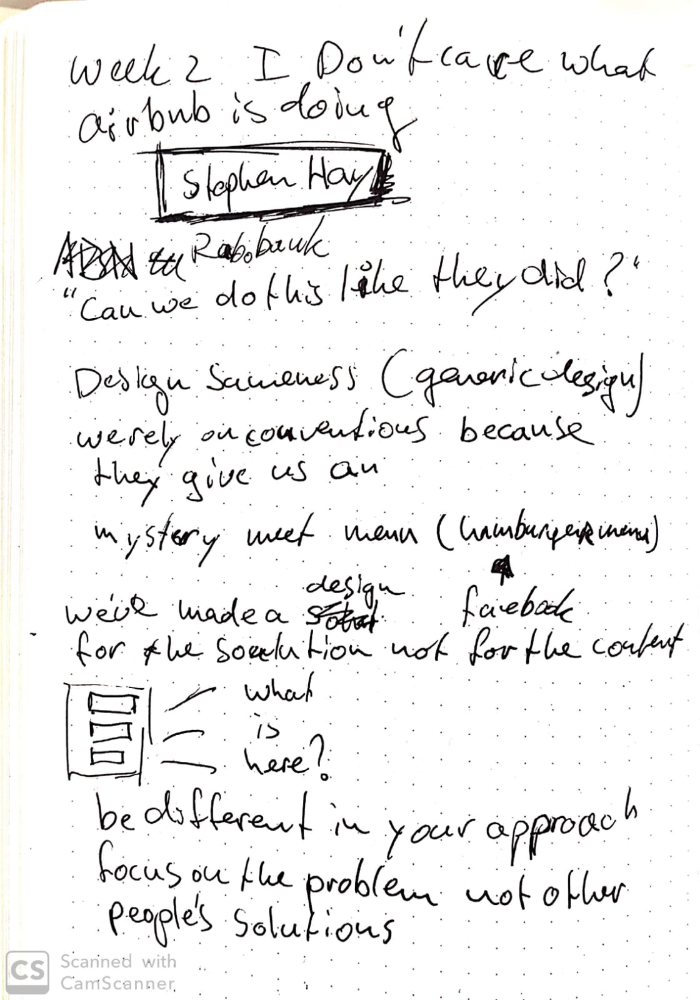
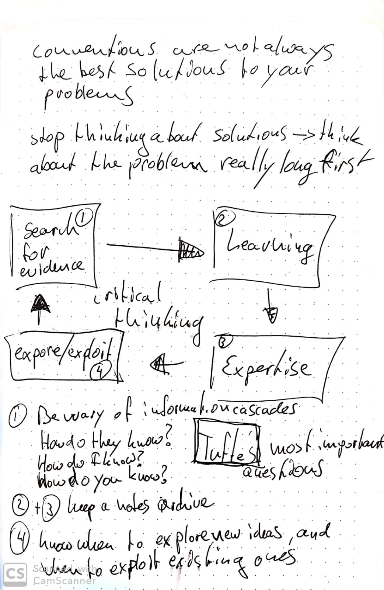
## 27 Februari

## 13 Maart
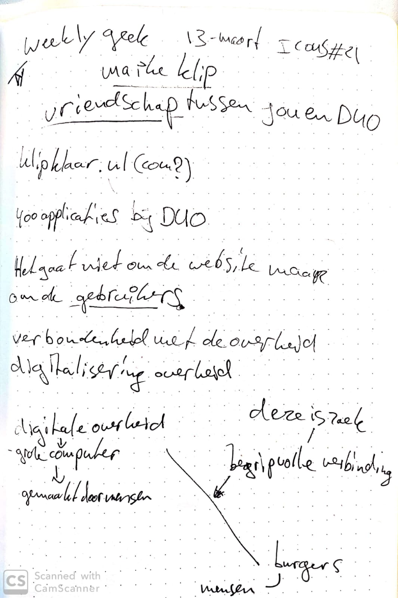
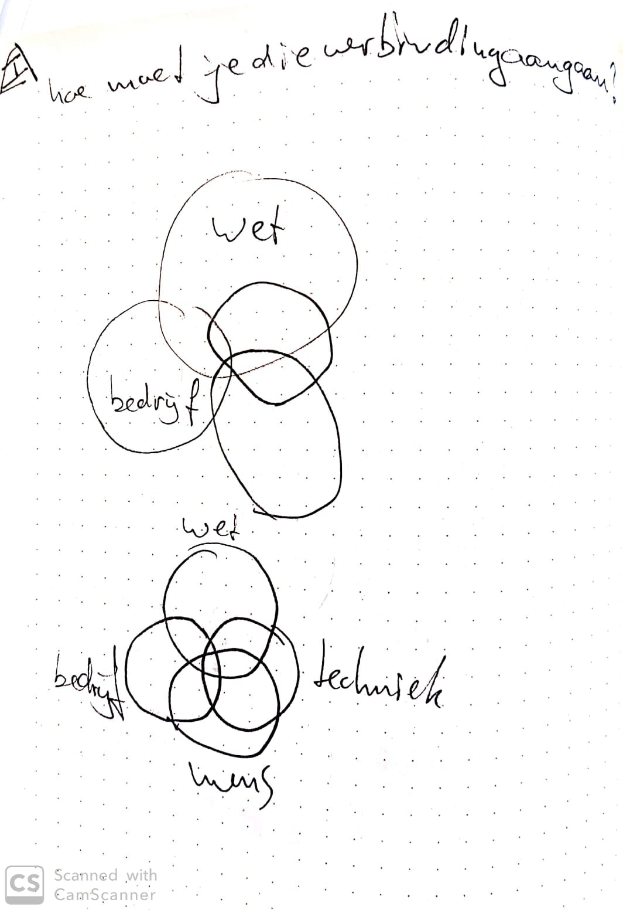
## 20 Maart
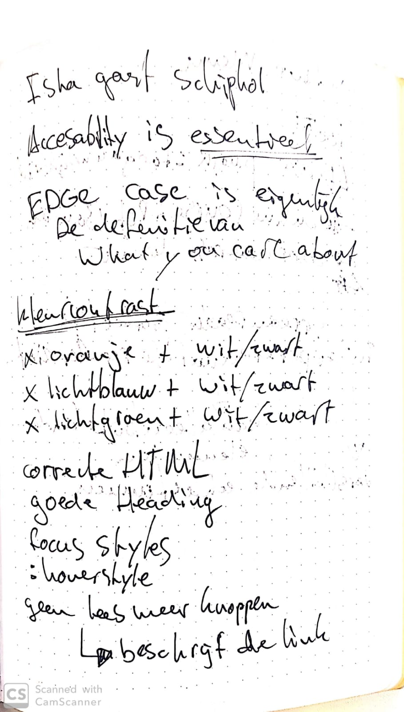
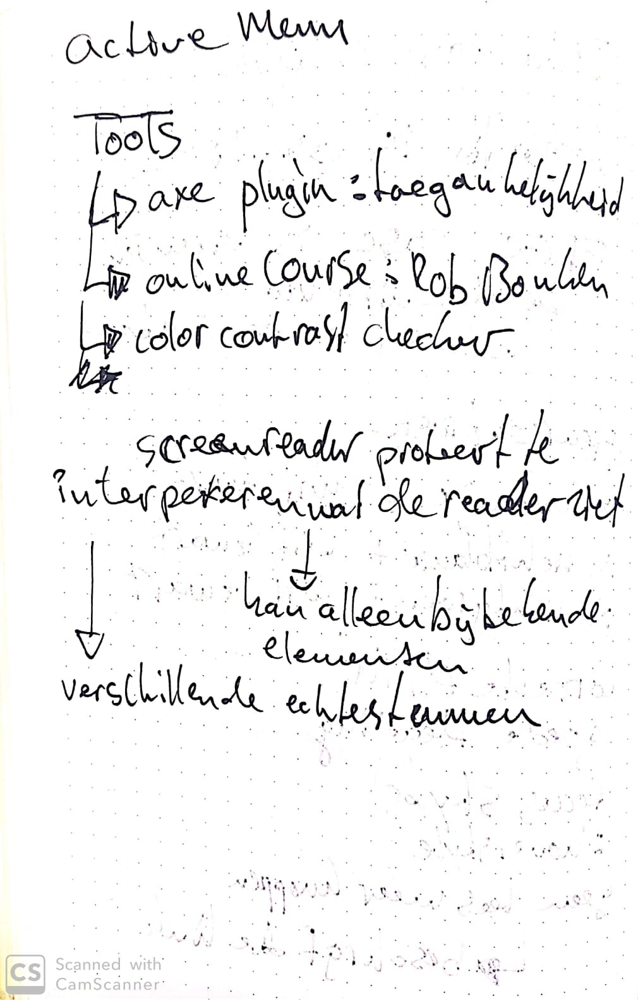
## 27 Maart
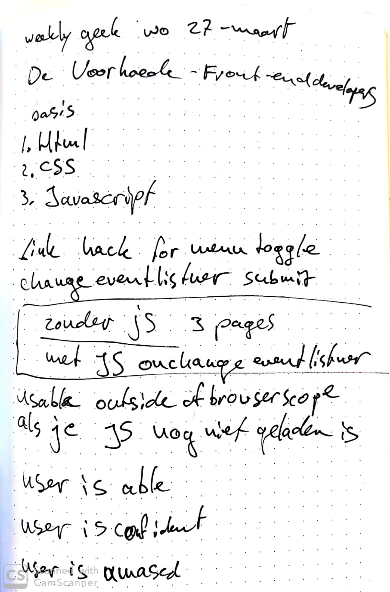
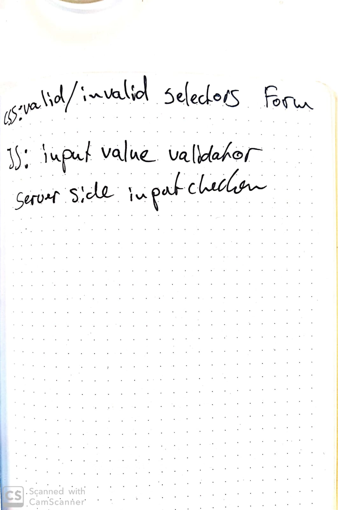
## 10 April
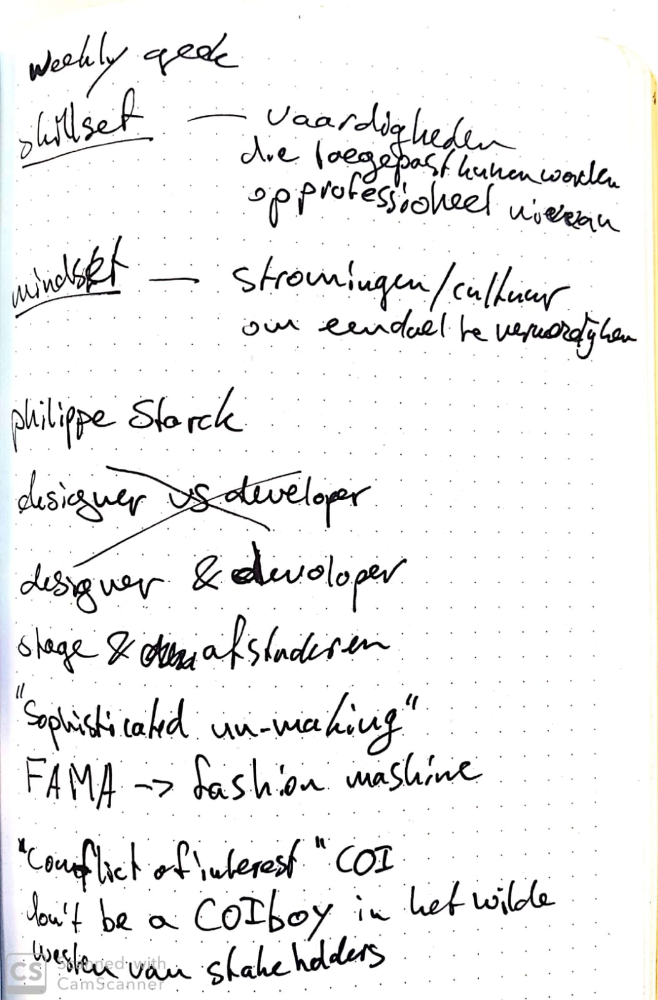
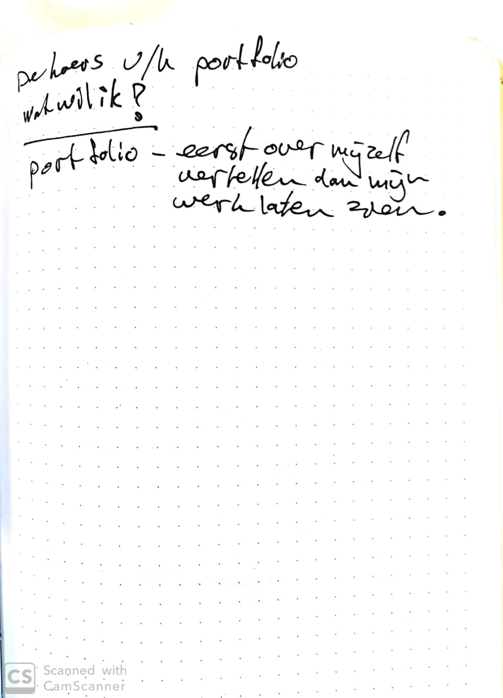
''
